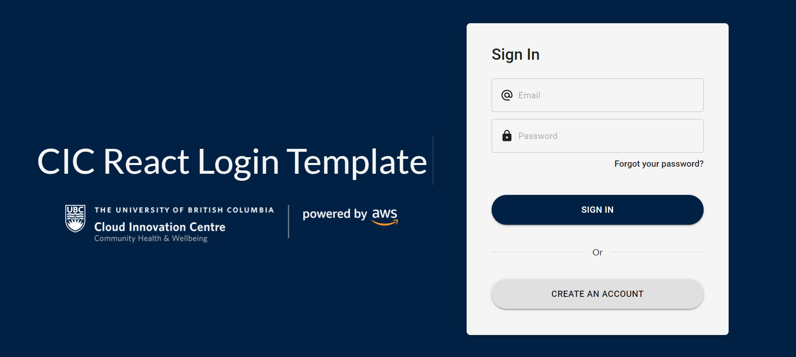
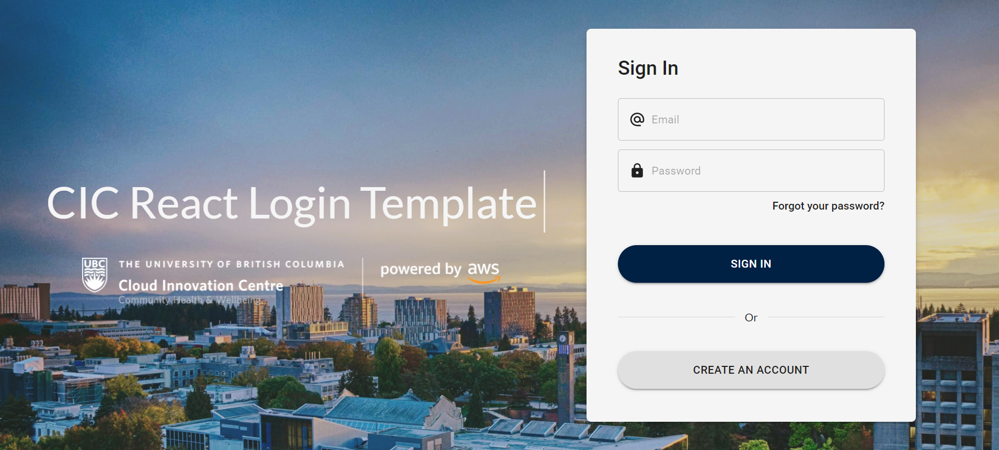
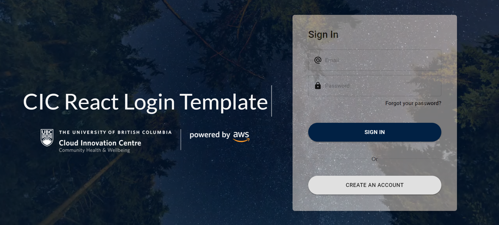
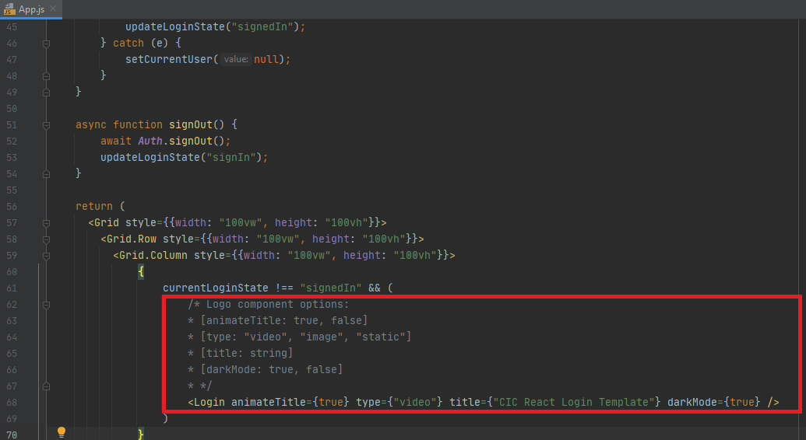
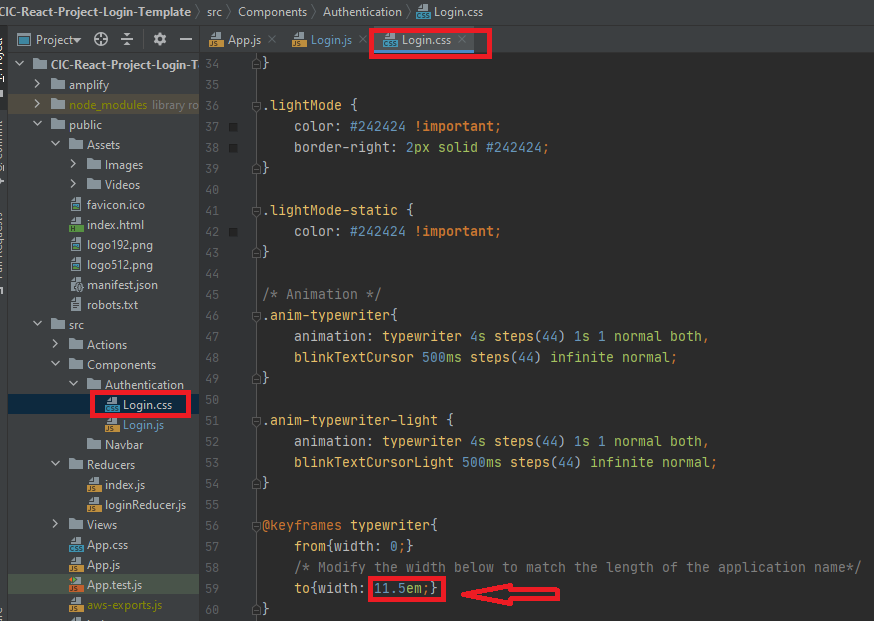
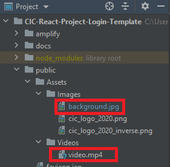
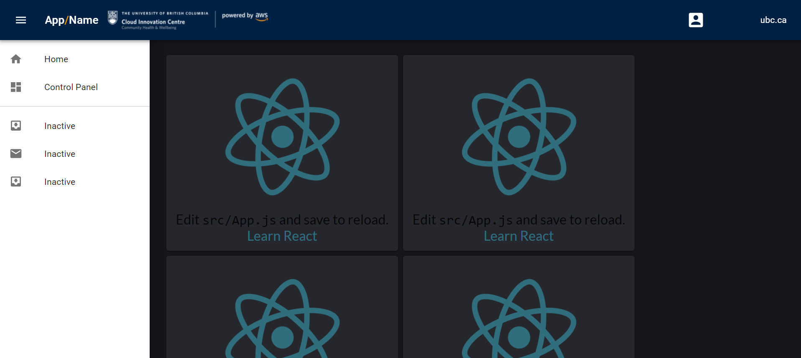

# cic-react-project-login-template
React project login template.

Three background options: static (blue background), image, or video

darkMode: True -->  Changes the CIC Logo and Font to a light color
          False --> Changes the CIC Logo and Font to a dark color        

## How To Use

The Logo component is rendered in the App.js file (the component itself is located under /src/Components/Authentication):

There are a few options, you can toggle the title animation on/off, change the background type, and you can turn on/off the dark mode

If using the title animiation option, in the Login.css file, you will need to modify the animation width to match the length of the application name title (so that the cursor stops at the correct position): 

If you want to change the given background image or video provided with this template, in the public/Assets/ folder, replace the background.jpg or video.mp4 files with identically named files of your choosing: 

An example Navbar with sign-out button and username information has been provided (rendered in /src/Views/PageContainer and the component itself is located under /src/Components/Navbar):

