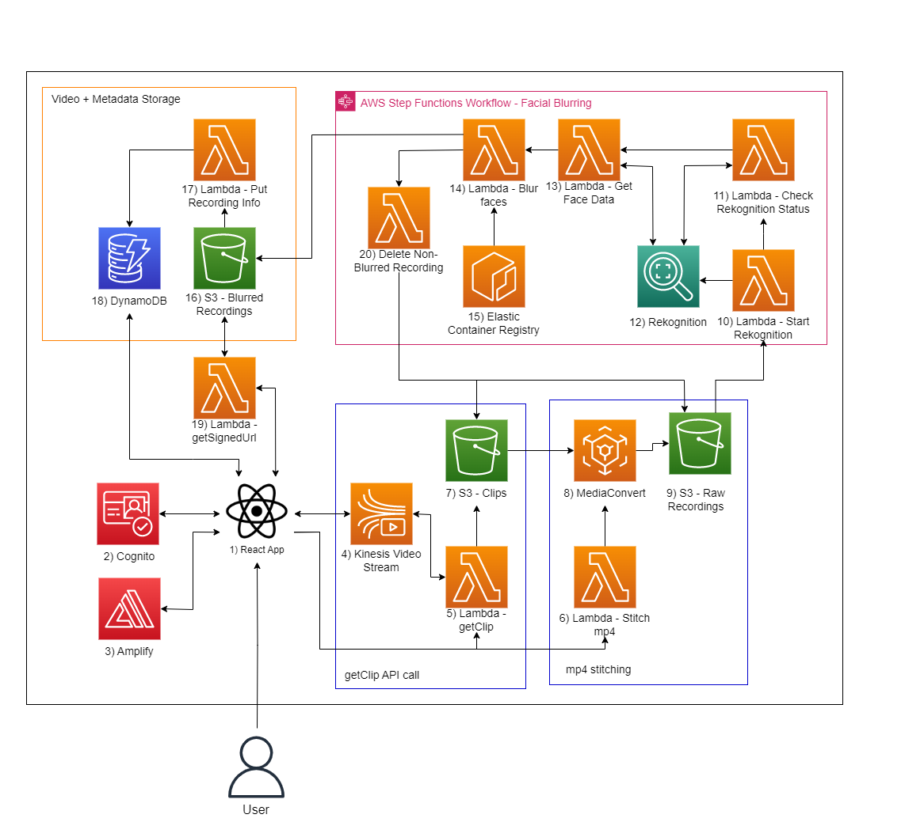
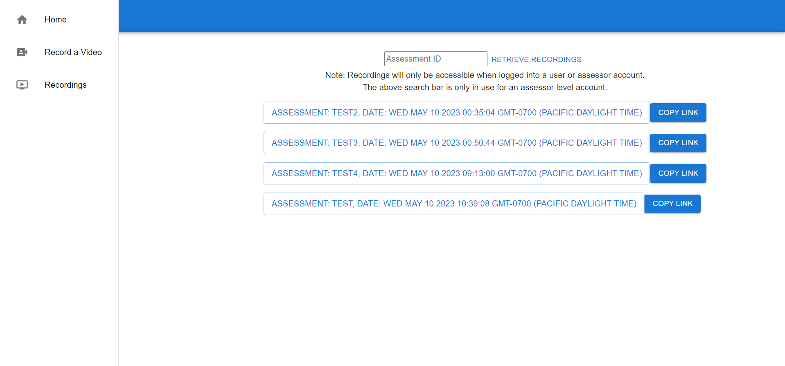

# Video Assessment Web App

There are many contexts in which the ability to record videos within a site would be helpful, when the process of recording externally then uploading videos onto a site is eliminated. As such the UBC CIC initiated the development of a prototype to provide users a simple and accessible web tool to record and submit videos.

|Index| Description|
|:---------------------------------------------------|:---------------------------------------------------------|
| [Stack Overview](#stack-overview)                  | The technologies powering the project.                   |
| [High Level Architecure](#high-level-architecture) | High level overview illustrating component interactions  |
| [Screenshots](#screenshots)                        | View screenshots of the application.                     |
| [Deployment](#deployment-guide)                    | Learn how to deploy this project yourself.               |
| [User Guide](#user-guide)                          | Learn how to use this application.                       |
| [License](#license)                                | License details.                                         |

## Stack Overview

The solution is a web application, which allows users to sign up via AWS Cognito, record and stream video to Kinesis Video Streams, or download their past recordings from an S3 bucket. An admin level account is also able to search by assessment ID to obtain videos made by any user submitted for that assessment.  

## High Level Architecture

The following architecture diagram illustrates the various AWS components utilized to deliver the solution.  

## Screenshots

### Login Page

### Recording Page

### Download Page

## Deployment Guide

To deploy this solution, please follow our [Deployment Guide](docs/DeploymentGuide.md).

## User Guide

For instructions on how to use the web app, refer to the [User Guide](docs/Userguide.md).

## Credits

This application was architected and developed by Michael O'Keefe and Muhan Li, with guidance from the UBC CIC technical and project management teams.

## License

This project is distributed under the [MIT License](LICENSE.txt).
