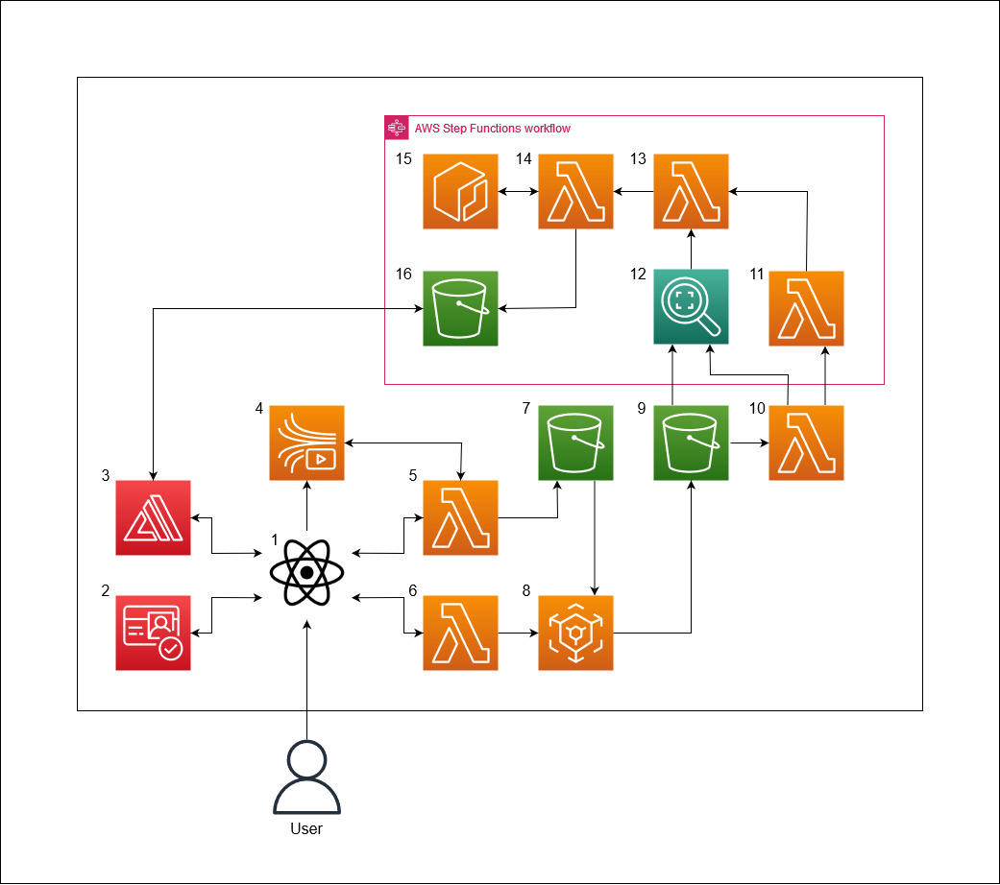

## Architecture Diagram

| ID | Resource Name                 | Description |
| -- | ----------------------------- | ----------- | 
| 1  | React frontend                | The web app through which an user will interact with the video streaming and recording functionalities
| 2  | Cognito                       | 
| 3  | Amplify                       | The scripts that make up the react front end is hosted using AWS Amplify
| 4  | Kinesis Video Streams         | The streaming and recording features are both implemented through Kinesis Video Streams. There are two components to the Kinesis Video Streams: signaling channels and streams. Signaling channels are used for communication between users, and streams are used to store the videos that are transferred through signaling channels. 
| 5  | Lambda (GetClip)              | The react frontend makes a call to this lambda function, which will make use of the getClip API when it is called. The getClip API is used to obtain 1 minute video clips from the Kinesis Video Stream (4). These clips are then uploaded to an S3 bucket (7) for processing.
| 6  | Lambda (mp4Stitch)            | After calling the getClip Lambda (5), the react frontend will then call this function to stitch the 1 minute clips into a whole recording. This is done through creating a MediaConvert (8) job that processes the clips and creates one single .mp4 file. This recording is uploaded to an S3 bucket (9) for further processing
| 7  | S3 (Clips)                    | One of three S3 buckets, this one serves as a temporary storage for clips before they are processed into recordings. The files in this bucket are grouped into folders named according to user IDs, then each folder contains clips that are named as: ${assessmentID}-{i}. Where 'i' acts similar to the variable of the same name in a for loop, so if there are 5 clips retrieved in one session, the 3rd clip would have i=3
| 8  | MediaConvert                  |
| 9  | S3 (Recording - Not blurred)  |
| 10 | Lambda (Start face detect)    |
| 11 | Lambda (Check job status)     |
| 12 | Rekognition                   |
| 13 | Lambda (Get faces info)       |
| 14 | Lambda (Blur faces)           |
| 15 | Elastic Container Registry    |
| 16 | S3 (Recording - Face blurred) |
