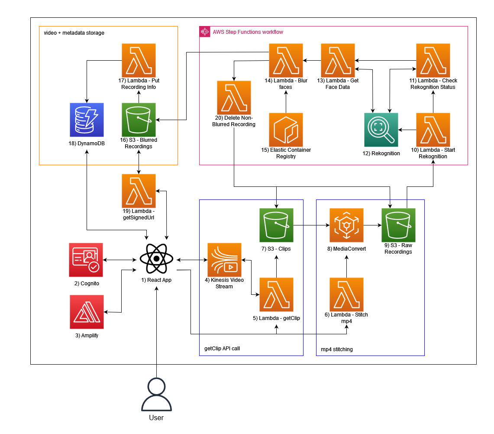
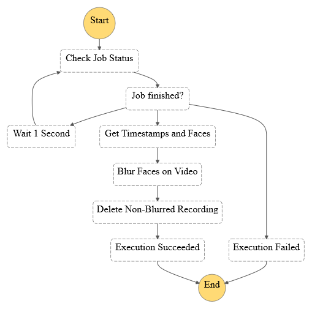

# Architecture Diagram

## Description 
| ID | Resource Name                 | Description |
| -- | ----------------------------- | ----------- | 
| 1  | React frontend                | The web app through which an user will interact with the video streaming and recording functionalities
| 2  | Cognito                       | Information about each user that accesses the web app is obtained through cognito. This information is then used to limit access to resources to ensure no user sees information that is not privy to them.
| 3  | Amplify                       | The scripts that make up the react front end is hosted using AWS Amplify
| 4  | Kinesis Video Streams         | The streaming and recording features are both implemented through Kinesis Video Streams. There are two components to the Kinesis Video Streams: signaling channels and streams. Signaling channels are used for communication between users, and streams are used to store the videos that are transferred through signaling channels. 
| 5  | Lambda (GetClip)              | The react frontend makes a call to this lambda function, which will make use of the getClip API when it is called. The getClip API is used to obtain 1 minute video clips from the Kinesis Video Stream (4). These clips are then uploaded to an S3 bucket (7) for processing.
| 6  | Lambda (mp4Stitch)            | After calling the getClip Lambda (5), the react frontend will then call this function to stitch the 1 minute clips into a whole recording. This is done through creating a MediaConvert (8) job that processes the clips and creates one single .mp4 file. This recording is uploaded to an S3 bucket (9) for further processing
| 7  | S3 (Clips)                    | One of three S3 buckets, this one serves as a temporary storage for clips before they are processed into recordings. The files in this bucket are grouped into folders named according to user IDs, then each folder contains clips that are named as: ${assessmentID}-{i}. Where 'i' acts similar to the variable of the same name in a for loop, so if there are 5 clips retrieved in one session, the 3rd clip would have i=3
| 8  | MediaConvert                  | MediaConvert is used to stitch the mp4 clips together into recordings. MediaConvert uses a queue to manage individual jobs, each individual job is responsible for combining the clips into recordings. The queue is allocated with the CDK, and each job is created through interacting with the mediaconvert API. When the job is complete, the recording is deposited in a S3 bucket (9).
| 9  | S3 (Recording - Not blurred)  | Two of three S3 buckets. This one is a temporary storage for recordings. For privacy, all recordings have their faces blurred before they're put into long term storage. The files in this bucket are grouped in a similar manner to the clips bucket (7). Each folder named according to user ID has recordings named according to: ${assessmentID}-{time of recording}. 
| 10 | Lambda (Start face detect)    | The start face detect lambda function serves as the kick start to the AWS step function (11-16) that blurs the faces in recordings. This lambda function is triggered by the upload of a .mp4 file to the S3 bucket (9) that stores recordings. The lambda function uses the Rekognition (12) API to start a machine learning script that detects all the faces that appear in a .mp4 recording.
| 11 | Lambda (Check job status)     | The first lambda function in the step function. This function checks the status of the Rekogition (12) job started by lambda function (10) every second until the job is complete. If the job complete successfully, the step function moves onto lambda function (13), if the job fails, the step function will exit with an error thrown.
| 12 | Rekognition                   | Rekognition provides an interface through which the web app can call upon machine learning scripts to accomplish the face blurring task. For more information on the face blurring using rekognition, please refer to the following [AWS blog post](https://aws.amazon.com/blogs/machine-learning/blur-faces-in-videos-automatically-with-amazon-rekognition-video/).
| 13 | Lambda (Get faces info)       | The second lambda in the step function. Once the Rekognition (12) job is complete, this function obtains all the information about each face that appear in the .mp4 recording; this information includes location in the video, the timestamp that they occur at, etc. This information is then passed to lambda function (14) to complete the face blurring job.
| 14 | Lambda (Blur faces)           | The final lambda in the step function, triggered by the completion of lambda function (13). This function is deployed with a Docker Image that is deployed in the ECR (15). The reason for this is because of the complexity of the task of blurring faces. Once the face blurring job is complete, the finished recordings are uploaded to the final S3 bucket (16).
| 15 | Elastic Container Registry    | The Docker Image used for lambda function (14) is uploaded and stored in the AWS Elastic Container Registry. This part is fully managed by the CDK deployment, for more information, refer to the deployment guide.
| 16 | S3 (Recording - Face blurred) | Recordings are uploaded and stored here after processing. Amplify access this bucket and is able to obtain recordings for users/administrators to view on the react web app.
| 17 | Lambda (Put recording info)   | Triggered by the upload of a new file into S3 (16), this function takes the userid, assessmentid, and assessment timestamp of the newly uploaded recording and updates the DynamoDB database with the information 
| 18 | DynamoDB                      | Database for storing assessment information - userid, assessmentid, timestamp of recordings. This database is queried by the react app to get the filename (key) when a user wants to retrieve a recording from the S3 storage (16)
| 19 | Lambda (Get Signed URL)       | Given a filename (key), this lambda function returns the signed url - a link that begins the download of the desired file when clicked
| 20 | Lambda (Delete Non-Blurred)   | After generating and uploading the blurred recording into S3 (16), delete the corresponding non-blurred version of the recording
---

## Step Function Diagram
The pink box that represents the step function has a very specific workflow that is represented by this diagram below.

For more information, refer to this [AWS blogpost](https://aws.amazon.com/blogs/machine-learning/blur-faces-in-videos-automatically-with-amazon-rekognition-video/).
