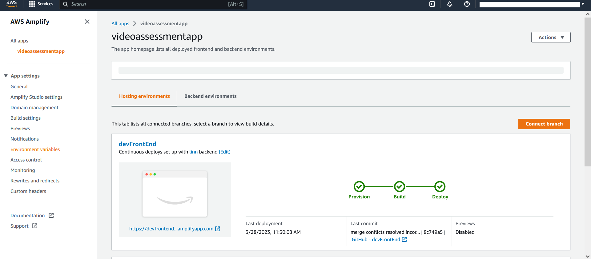

# Requirements

Before you deploy, you must have the following in place:
*  [AWS Account](https://aws.amazon.com/account/) 
*  [GitHub Account](https://github.com/) 
*  [AWS CLI](https://aws.amazon.com/cli/) 
*  [AWS SAM](https://docs.aws.amazon.com/serverless-application-model/latest/developerguide/serverless-sam-cli-install.html)
*  [Docker Desktop](https://www.docker.com/products/docker-desktop/)  


# Step 1: Clone The Repository

First, clone the github repository onto your machine. To do this:
1. Create a folder on your desktop to contain the code.
2. Open terminal (or command prompt if on windows) and **cd** into the above folder.
3. Clone the github repository by entering the following:
```bash
git clone https://github.com/UBC-CIC/video-assessment-project.git
```

The code should now be in the above folder. Now navigate into the video-assessment-project folder by running the following command:
```bash
cd video-assessment-project
```


# Step 2: Frontend Deployment (TODO)

Before installing Amplify we need to create the IAM Role that associate the policies need to implement this solution. 
Navigate to the cloned directory, execute the follow CloudFormation template:

```bash
aws cloudformation deploy --template-file cfn-amplifyRole.yaml --stack-name amplifyconsole-tapgives-backend-role --capabilities CAPABILITY_NAMED_IAM
```

If you have multiple AWS Profiles, specify one with sufficient admin permissions by appending this to the command, replacing the profile name 

```bash
--profile [PROFILE NAME]
```
The previous command creates the role name **amplifyconsole-tapgives-backend-role** that will be used on the next step.

The **Deploy to Amplify Console** button will take you to your AWS console to deploy the front-end solution.

<a href="https://console.aws.amazon.com/amplify/home#/deploy?repo=https://github.com/UBC-CIC/TapGives">
    
</a>

1. On the AWS console. select your region on the top right, then connect to github
2. Select the **amplifyconsole-tapgives-backend-role** for deployment
3. The deployment will take a few minutes.  Wait until the status shows **Verify** in green
4. Click on left taskbar to open menu, click on Rewrites and redirects, and click on edit 
5. Click and replace the first rule's source address (or add a rule if there is none) to ```</^[^.]+$|\.(?!(css|gif|ico|jpg|js|png|txt|svg|woff|woff2|ttf|map|json)$)([^.]+$)/>```, click and replace target address to ```/index.html```, and select and replace **type** with ```200 (Rewrite)```, then save.  
Refer to [AWS's Page on Single Page Apps](https://docs.aws.amazon.com/amplify/latest/userguide/redirects.html#redirects-for-single-page-web-apps-spa) for further information on why we did that


Congratulations, your web app is now deployed!


# Step 3: Backend Deployment

## Configure AWS CLI
Ensure Docker is running, and begin configuring the AWS credentials by typing the following line in the CLI
```bash
aws configure
```
Please note that it is expected for your account to have administrator access for the steps in this deployment guide

## Deploy Backend (Lambdas + S3)
Once the AWS CLI has been configured with the credentials, navigate to the directory named 'cdk' 
```bash
cd cdk
```
The 'cdk' directory contains the python files that describe how the AWS resources should be deployed using the CDK. 

Subdirectories under the directory '/cdk/lambda' each contain the code for the lambda functions that make up the majority of the backend

Run the following commands in the CLI to install the dependencies required for the CDK deployment
```bash
npm install -g aws-cdk
pip install -r requirements.txt
```

The next two commands will provision resources required to deploy the full stack (backend), and begin the deployment process.
```bash
cdk bootstrap
cdk deploy
```
## Delete / Cleanup
In order to delete the stack deployed in the step above, run the following command
```bash
cdk destroy
```

## Configure Environmental Variables
Environmental variables on the Amplify deployment will provide information about the lambda functions that make up the backend. 

Start by navigating to the [CloudFormation console](https://us-west-2.console.aws.amazon.com/cloudformation/home?region=us-west-2#/).

Open the sidebar and navigate to the "stacks" section


The stack named "RecordWithFaceBlurStack" should be the first item in the list, click on it in order to display information about the deployed stack.


Select the tab named "resources"


Find the two resources with "GetClip" and "mp4stitch" in their names, click on the blue link in the column "physical id". These links will open new tabs that contain more information about these specific lambda functions.


In the new tab, use the "copy ARN" button to copy the ARN of the lambda function, paste this in a temporary text file. Repeat this process for the lambda function with "mp4stitch" in its name.


Now, navigate to the [Amplify console](https://us-west-2.console.aws.amazon.com/amplify/home?region=us-west-2#/), the front end that was deployed in part 1 should be visible here.

Click on the app that corresponds to the one deployed in part 1, then select the "environment variables" tab on the left bar.


Click on "manage variables" to open the following page, use the "add variable" button to add the following variables:
| Variable      | Value |
| --------      | ----- |
| GETCLIP_ARN   | copy the corresponding arn from the temporary text file prepared 
| MP4STITCH_ARN | copy the corresponding arn from the temporary text file prepared
------
Click save to save the variable configuration 

