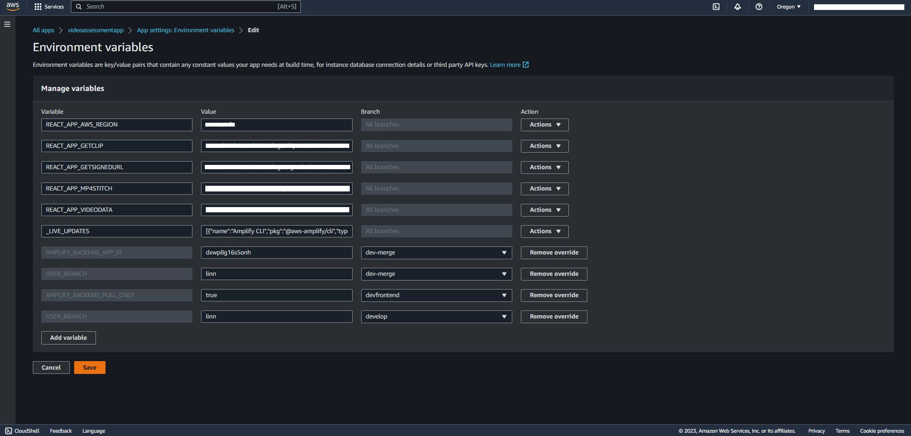
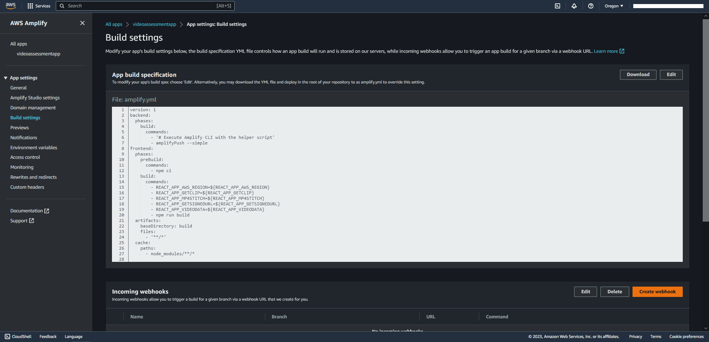

# Deployment Guide

## Requirements

Before you deploy, you must have the following in place:

* [AWS Account](https://aws.amazon.com/account/)
* [GitHub Account](https://github.com/)
* [AWS CLI](https://aws.amazon.com/cli/)
* [Docker Desktop](https://www.docker.com/products/docker-desktop/)

## Step 1: Clone The Repository

First, clone the github repository onto your machine. To do this:

1. Create a folder on your desktop to contain the code.
2. Open terminal (or command prompt if on windows) and **cd** into the above folder.
3. Clone the github repository by entering the following:

```bash
git clone https://github.com/UBC-CIC/video-assessment-project.git
```

The code should now be in the above folder. Now navigate into the video-assessment-project folder by running the following command:

```bash
cd video-assessment-project
```

## Step 2: Frontend Deployment

Before installing Amplify we need to create the IAM Role that associate the policies need to implement this solution. 
Navigate to the cloned directory, execute the follow CloudFormation template:

```bash
aws cloudformation deploy --template-file cfn-amplifyRole.yaml --stack-name amplifyconsole-video-assessment-backend-role --capabilities CAPABILITY_NAMED_IAM
```

If you have multiple AWS Profiles, specify one with sufficient admin permissions by appending this to the command, replacing the profile name 

```bash
--profile [PROFILE NAME]
```

The previous command creates the role name **amplifyconsole-video-assessment-backend-role** that will be used on the next step.

The **Deploy to Amplify Console** button will take you to your AWS console to deploy the front-end solution.

[](https://console.aws.amazon.com/amplify/home#/deploy?repo=https://github.com/UBC-CIC/video-assessment-project)

1. On the AWS console. select your region on the top right, then connect to GitHub. Note that at the time of development this project was limited to the us-west-2 region. 
2. Select the **amplifyconsole-video-assessment-backend-role** for deployment
3. The deployment will take a few minutes.  Wait until the status shows **Verify** in green
4. Click on left taskbar to open menu, click on Rewrites and redirects, and click on edit 
5. Click and replace the first rule's source address (or add a rule if there is none) to ```</^[^.]+$|\.(?!(css|gif|ico|jpg|js|png|txt|svg|woff|woff2|ttf|map|json)$)([^.]+$)/>```, click and replace target address to ```/index.html```, and select and replace **type** with ```200 (Rewrite)```, then save.  
Refer to [AWS's Page on Single Page Apps](https://docs.aws.amazon.com/amplify/latest/userguide/redirects.html#redirects-for-single-page-web-apps-spa) for further information on why we did that


Next, you will create the necessary permissions for logged in users to use the application. Please navigate to the AWS IAM Console and go to the Policies Page.

Click on the Create Policy button in the top right corner.


Next, find the file named userpolicy.json within the '/deploy' directory of the project. In the IAM Console, switch the view from Visual to JSON, and paste the contents of the above file in the Policy Editor.


Click the Next button in the bottom right corner to proceed. On the next page, name your Policy and then click the Create Policy button to finish this task.

Now you will attach the policy to the Authenticated User Role associated with the web app. Navigate back to the IAM Console home page and click on the Roles tab.

Find the role named 'amplify-videoassessmentapp-####-######-authRole' and click on the Role name.


Here, select 'Add permissions' and click on 'Attach policies' in the dropdown.


On the next page, find and attach the policy you created in the previous steps. 

Congratulations, your front end is now deployed!

# Step 3: Backend Deployment

## Configure AWS CLI
Ensure Docker is running, and begin configuring the AWS credentials by typing the following line in the CLI
```bash
aws configure
```
Please note that it is expected for your account to have administrator access for the steps in this deployment guide

## Deploy Backend (Lambdas + S3)
Once the AWS CLI has been configured with the credentials, navigate to the directory named 'cdk' 
```bash
cd cdk
```
The 'cdk' directory contains the python files that describe how the AWS resources should be deployed using the CDK. 

Subdirectories under the directory '/cdk/lambda' each contain the code for the lambda functions that make up the majority of the backend

Run the following commands in the CLI to install the dependencies required for the CDK deployment
```bash
npm install -g aws-cdk
pip install -r requirements.txt
```

The next two commands will provision resources required to deploy the full stack (backend), and begin the deployment process.
```bash
cdk bootstrap
cdk deploy
```
## Delete / Cleanup
In order to delete the stack deployed in the step above, run the following command
```bash
cdk destroy
```

## Configure Environmental Variables
Environmental variables on the Amplify deployment will provide information about the lambda functions that make up the backend. 

Start by navigating to the [CloudFormation console](https://us-west-2.console.aws.amazon.com/cloudformation/home?region=us-west-2#/).

Open the sidebar and navigate to the "stacks" section


The stack named "RecordWithFaceBlurStack" should be the first item in the list, click on it in order to display information about the deployed stack.


Select the tab named "resources"


Find the resources with "GetClip", "mp4stitch", "getsignedurl", and "videodata" in their names, copy the names of the lambda functions in the column "physical id", and paste them to the location described in the next 2 steps.


Now, navigate to the amplify console that you used in step 1 to deploy the frontend of the project. In the sidebar on the left, navigate to the "environmental variables" section. 


Click on manage variables, then add the five following variables
|Name|Value|
|----|-----|
|REACT_APP_AWS_REGION|us-west-2|
|REACT_APP_GETCLIP|paste name of your getclip function here (from the step above)|
|REACT_APP_MP4STITCH|paste name of mp4stitch function here|
|REACT_APP_GETSIGNEDURL|paste name of getsignedurl function here|
|REACT_APP_VIDEODATA|paste name of the videodata dynamodb table here|

Once you have added the five variables, your screen should look something like the image below, click save to save your changes


Finally, navigate to the "build settings" section in the left sidebar. In the upper right corner of the box labeled "app build specification", click on the edit button to edit the build configuration. 


A windowed text editor should appear, and the file should look like something this
```
version: 1
backend:
  phases:
    build:
      commands:
        - '# Execute Amplify CLI with the helper script'
        - amplifyPush --simple
frontend:
  phases:
    preBuild:
      commands:
        - npm ci
    build:
      commands:
        - npm run build
  artifacts:
    baseDirectory: build
    files:
      - '**/*'
  cache:
    paths:
      - node_modules/**/*
```

Under the section frontend->build->commands, right above the line 'npm run build' paste the following lines
```
- REACT_APP_AWS_REGION=${REACT_APP_AWS_REGION}
- REACT_APP_GETCLIP=${REACT_APP_GETCLIP}
- REACT_APP_MP4STITCH=${REACT_APP_MP4STITCH}
- REACT_APP_GETSIGNEDURL=${REACT_APP_GETSIGNEDURL}
- REACT_APP_VIDEODATA=${REACT_APP_VIDEODATA}
```

The "frontend" section of your file should look like this after pasting the lines
```
frontend:
  phases:
    preBuild:
      commands:
        - npm ci
    build:
      commands:
        - REACT_APP_AWS_REGION=${REACT_APP_AWS_REGION}
        - REACT_APP_GETCLIP=${REACT_APP_GETCLIP}
        - REACT_APP_MP4STITCH=${REACT_APP_MP4STITCH}
        - REACT_APP_GETSIGNEDURL=${REACT_APP_GETSIGNEDURL}
        - REACT_APP_VIDEODATA=${REACT_APP_VIDEODATA}
        - npm run build
```

Click save to save your changes and exit the text editor. Then, go to your app, and click on the front end as shown in the image below.


In this menu, click on the button in the upper right corner labeled 'redeploy this version' in order for the updated environmental variables to take effect.
