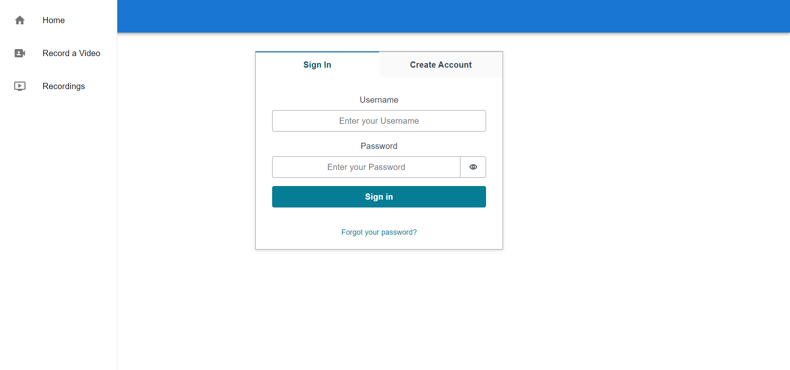
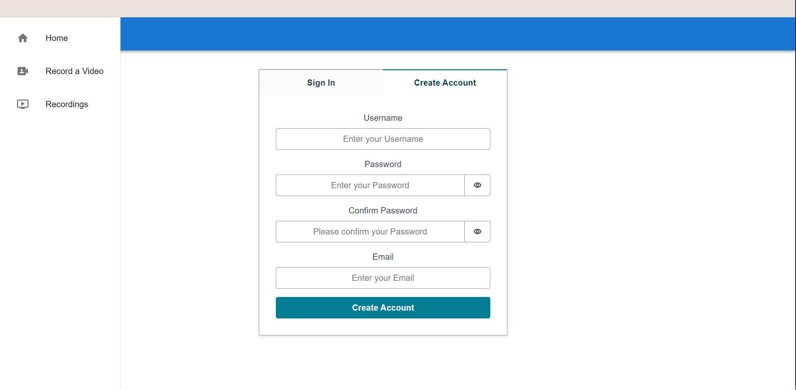
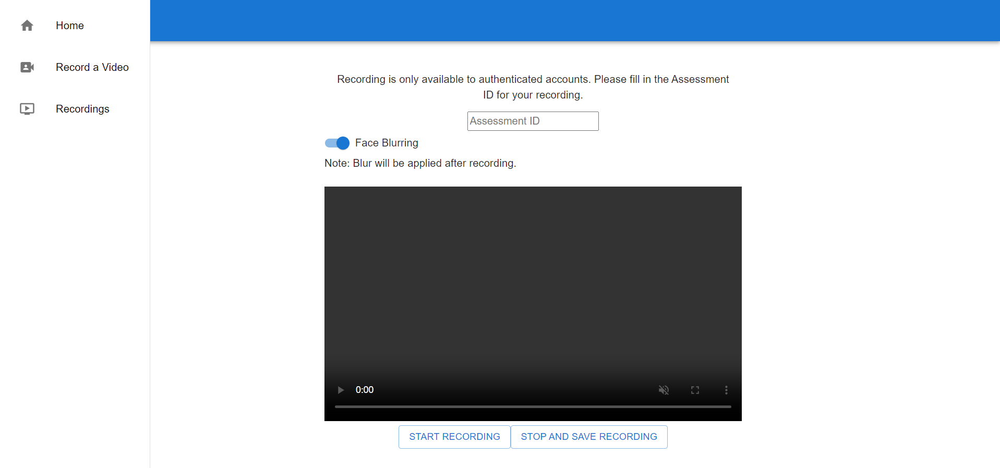
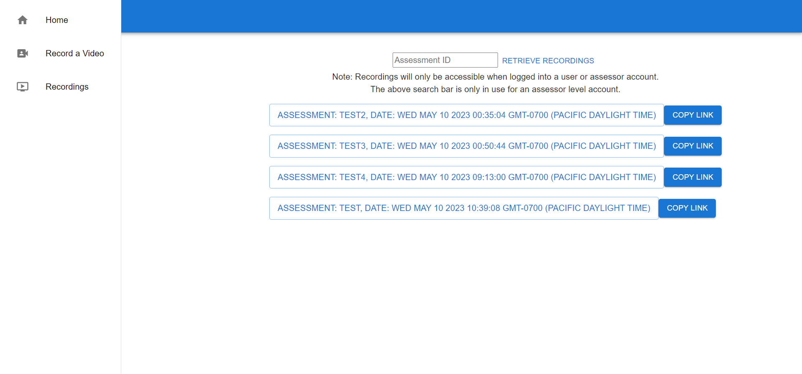

# User Guide

**Before Continuing with this User Guide, please make sure you have deployed the frontend and backend stacks.**

- [Deployment Guides](./DeploymentGuide.md)

| Index                                                               | Description                                                                                        |
| :------------------------------------------------------------------ | :------------------------------------------------------------------------------------------------- |
| [Login Page](#login-page)                                       | Features on the login page                                                                       |
| [Recording Page](#recording-page)                               | How to create recordings                                                                               |
| [Download Page](#download-page)                                     | How to download recordings                                       |
|                                                      |

## Login Page

The Home/Login Page is the landing page that a user first interacts with on the video streaming app. On this page, a user will either login to an existing account, or create an account in order to begin submitting videos.

### 1. Login

- The `Username` field is for a predetermined username set by the user when they first created an account
- The `Password` field is for a set password chosen by the user when they first created the account. The text entered in this field is hidden by default, and can be revealed by clicking the eye located at the right edge of this field
  

### 2. Create Account

- The `Username` must be unique and will be used for signing in a user into their account
- The `Password` and `Confirm Password` fiels ensures that the user has a valid password and that the user is not mistaken about the contents of their password. There are several requirements along the lines of capitalized characters, special characters, and minimum character count that ensure the password is of sufficient strength
  

### 3. Sidebar

- The `Home` tab takes the user to this exact login page
- The `Record a Video` tab takes the user to the [Recording Page](#Recording-Page)
- The `Recordings` tab takes the user to the [Download Page](#download-page)

## Recording Page

The two buttons and one switch on this page are the three ways for the user to interact with the video recording function. 
- The `Start Recording` button starts the camera feed and sets the timestamp that marks the beginning of the recording session. Pressing this button while the recording is ongoing will reset the starting time
- The `Stop and Save Recording` button stops the camera feed and sets the timestamp that marks the end of the recording session. The time it takes to save a recording is dependent on the length of the recording, after a short amount of time, the user will be able to find their recording on the [Download Page](#download-page)
- The `Face blurring` switch sets whether the saved recording will have faces blurred or unblurred. Users may receive specific instructions from the assessment provider whether a recording should have faces blurred. Users may also be given the choice of having their faces blurred for privacy concerns. The implementation of this switch is ambiguous due to the different potential use cases.
  

## Download Page

This page displays a series of buttons, each row corresponding to a recording that was made by the user. Clicking on the informative `Download Button` will start the download process for the corresponding recording, while clicking on the `Copy Link` button will copy a presigned URL for the download to the user's clipboard, which they can share with others.

